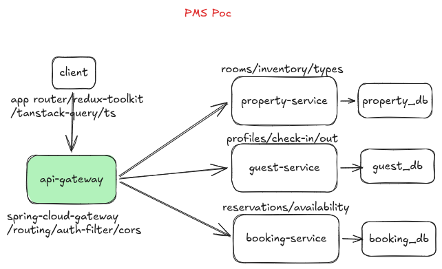

# MiniStay (Hotel PMS MVP)

Personal POC project for a microservices-based hotel management system. Built to get familiar with a **Next.js** client, **PostgreSQL** and **Spring Boot** microservice backend architecture.




**Run Services**
```
npx concurrently -c "cyan,green,blue,magenta" -n "GATEWAY,PROPERTY,BOOKING,GUEST" \
"cd services/api-gateway && ./mvnw spring-boot:run" \
"cd services/property-service && ./mvnw spring-boot:run" \
"cd services/booking-service && ./mvnw spring-boot:run" \
"cd services/guest-service && ./mvnw spring-boot:run"
```


- API Gateway
```
curl https://start.spring.io/starter.tgz -d type=maven-project -d language=java -d baseDir=api-gateway -d groupId=com.ministay -d artifactId=api-gateway -d name=api-gateway -d javaVersion=21 -d dependencies=cloud-gateway,actuator | tar -xzvf -
```
- Property Service
```
curl https://start.spring.io/starter.tgz -d type=maven-project -d language=java -d baseDir=property-service -d groupId=com.ministay -d artifactId=property-service -d name=property-service -d javaVersion=21 -d dependencies=web,data-jpa,postgresql,actuator,lombok,validation | tar -xzvf -
```
- Booking Service
```
curl https://start.spring.io/starter.tgz -d type=maven-project -d language=java -d baseDir=booking-service -d groupId=com.ministay -d artifactId=booking-service -d name=booking-service -d javaVersion=21 -d dependencies=web,data-jpa,postgresql,actuator,lombok,validation | tar -xzvf -
```
- Guest Service
```
curl https://start.spring.io/starter.tgz -d type=maven-project -d language=java -d baseDir=guest-service -d groupId=com.ministay -d artifactId=guest-service -d name=guest-service -d javaVersion=21 -d dependencies=web,data-jpa,postgresql,actuator,lombok,validation | tar -xzvf -
```

- Connect to the running container's postgres
```
docker exec -it property-db psql -U postgres -d property_db
```

